# ☁️ Azure Cloud – Sprawozdanie z Laboratoriów (Pd5206)

> Projekt dokumentuje praktyczne ćwiczenia z platformy **Microsoft Azure**: tworzenie maszyn wirtualnych, konfigurację sieci wirtualnych, zarządzanie grupami zabezpieczeń (NSG) oraz konfigurację zapory sieciowej (Azure Firewall).

---

## 📋 Spis treści

- [Rozdział 1 – Wprowadzenie do Azure](#rozdział-1--wprowadzenie-do-azure)
- [Rozdział 2 – Maszyny wirtualne](#rozdział-2--maszyny-wirtualne)
- [Rozdział 3 – Sieci wirtualne i NSG](#rozdział-3--sieci-wirtualne-i-nsg)
- [Rozdział 4 – Zapora sieciowa (Azure Firewall)](#rozdział-4--zapora-sieciowa-azure-firewall)
- [Wnioski końcowe](#wnioski-końcowe)
- [Struktura repozytorium](#struktura-repozytorium)

---

## Rozdział 1 – Wprowadzenie do Azure

### 1.2.1 – Pierwsze kroki w portalu Azure

Portal Azure ([portal.azure.com](https://portal.azure.com)) to główny interfejs graficzny do zarządzania zasobami chmurowymi Microsoft. Umożliwia tworzenie, monitorowanie i usuwanie zasobów takich jak maszyny wirtualne, sieci, bazy danych i wiele innych.

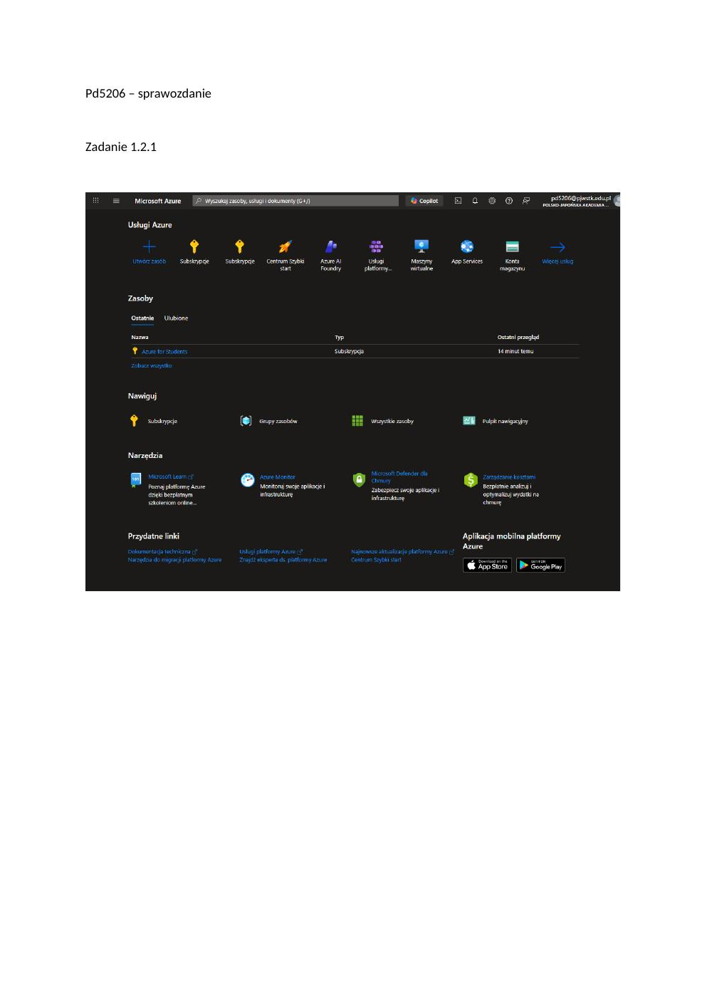

---

### 1.3.1 – Przegląd usług

Portal oferuje intuicyjny katalog usług pogrupowanych według kategorii:

- **Obliczenia** – maszyny wirtualne, kontenery, serverless
- **Sieć** – VNet, Load Balancer, Firewall, Application Gateway
- **Przechowywanie** – Blob Storage, Disk Storage, Azure Files
- **Tożsamość** – Azure AD, Role-Based Access Control (RBAC)

---

### 1.4.1 & 1.4.2 – Propozycje usług od Microsoft

Microsoft Azure udostępnia modele usług:

| Model | Opis | Przykłady |
|-------|------|-----------|
| **IaaS** | Infrastruktura jako usługa | Virtual Machines, VNet |
| **PaaS** | Platforma jako usługa | App Service, Azure SQL |
| **SaaS** | Oprogramowanie jako usługa | Microsoft 365, Dynamics |

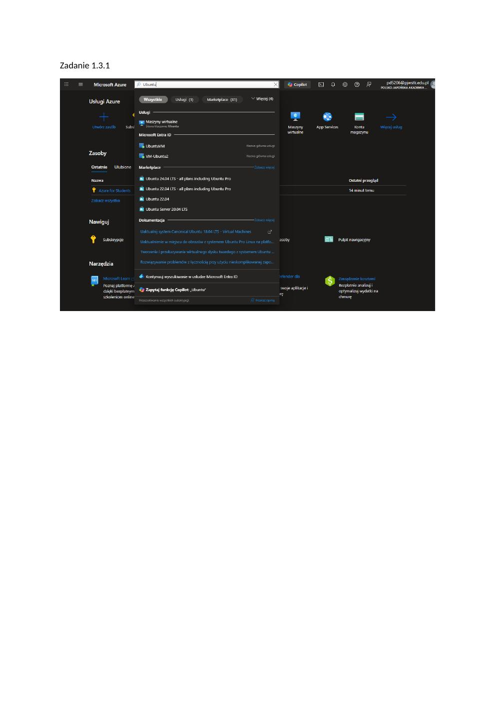

---

## Rozdział 2 – Maszyny wirtualne

### 2.2.1 – Tworzenie maszyny wirtualnej

W Azure możemy tworzyć maszyny wirtualne (VM) z systemem Linux lub Windows. Podczas tworzenia konfigurujemy:

1. **Subskrypcję i grupę zasobów** – logiczne kontenery na zasoby
2. **Nazwę i region** – lokalizacja centrum danych (np. West Europe)
3. **Obraz systemu** – Ubuntu Server 20.04 LTS, Windows Server 2022, itp.
4. **Rozmiar VM** – określa liczbę vCPU i ilość RAM (np. B1s – 1 vCPU, 1 GB RAM)
5. **Metodę uwierzytelniania** – klucz SSH (Linux) lub hasło (Windows)

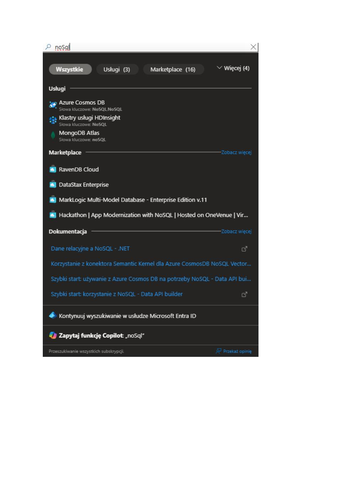

---

### 2.3.2 – Maszyna wirtualna na Linuxie i Windowsie

#### Linux VM (Ubuntu)

```bash
# Połączenie SSH z maszyną Linux
ssh -i ~/.ssh/klucz_prywatny azureuser@<publiczny-adres-IP>

# Sprawdzenie informacji o systemie
uname -a
ls -la
```

Maszyna wirtualna Ubuntu pozwala na zarządzanie przez terminal SSH. Klucz publiczny jest dodawany podczas tworzenia VM, a klucz prywatny jest przechowywany lokalnie.

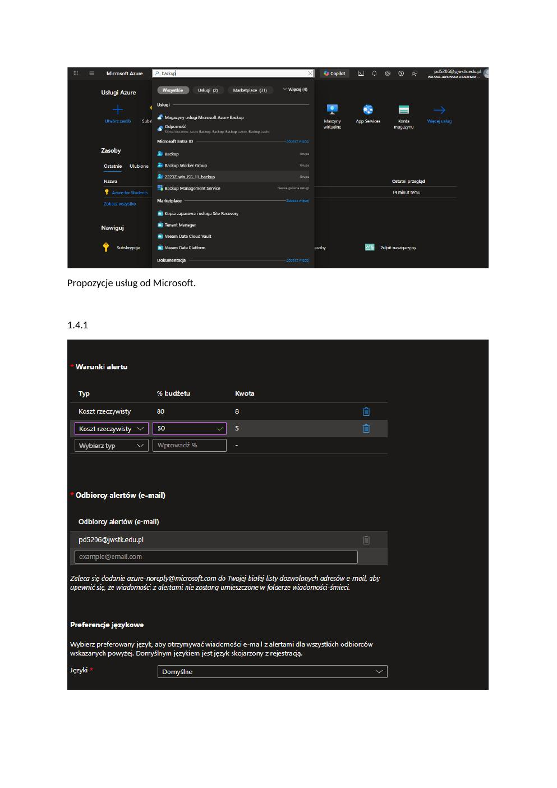

#### Windows VM

Maszyna wirtualna z systemem Windows jest dostępna przez protokół **RDP (Remote Desktop Protocol)** na porcie **3389**.

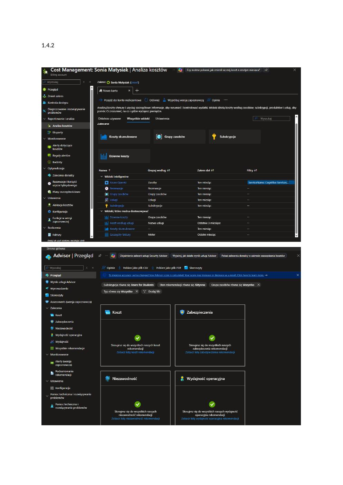

---

### 2.7.1 – Komenda `ls -la`

Po połączeniu SSH z maszyną Linux możemy weryfikować środowisko:

```bash
ls -la
```

Komenda wypisuje zawartość katalogu wraz z ukrytymi plikami, uprawnieniami, właścicielem oraz datą modyfikacji każdego pliku.

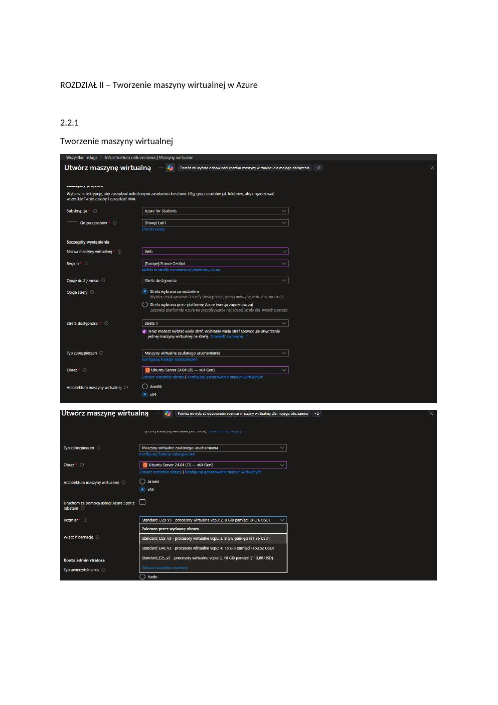

---

### 2.8.1 & 2.8.2 – Dane maszyn i klucze dostępu

Portal Azure udostępnia pełny podgląd wszystkich zasobów, w tym:

- Nazwy maszyn wirtualnych
- Publiczne i prywatne adresy IP
- Klucze dostępu (dla Storage Accounts)
- Status działania i logi aktywności

> ⚠️ **Ważne:** Klucze dostępu do zasobów powinny być traktowane jak hasła – nie udostępniaj ich publicznie ani nie umieszczaj w kodzie źródłowym. Używaj **Azure Key Vault** do bezpiecznego przechowywania sekretów.

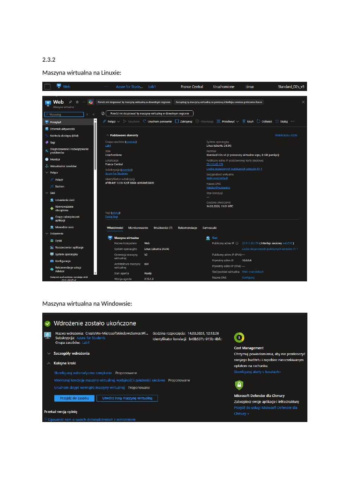

---

### 2.9.1 – Wszystkie utworzone zasoby

Wszystkie zasoby projektu są widoczne w **Grupie Zasobów** (Resource Group), co ułatwia zarządzanie i usuwanie zasobów po zakończeniu pracy.

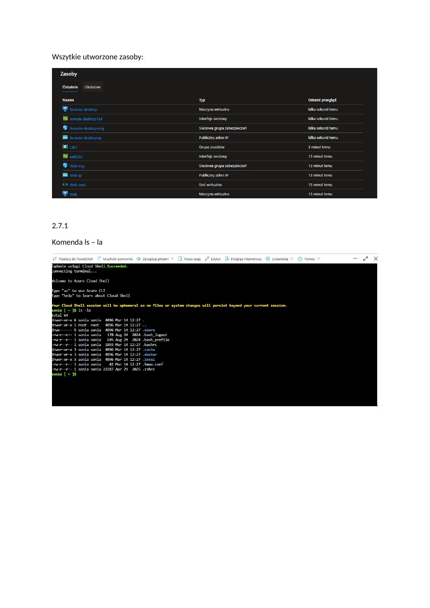

---

## Rozdział 3 – Sieci wirtualne i NSG

### 3.2.1 – Tworzenie sieci wirtualnej (VNet)

**Virtual Network (VNet)** to izolowana sieć w chmurze Azure. Pozwala na:
- Definiowanie własnej przestrzeni adresowej IP (np. `172.16.0.0/16`)
- Tworzenie podsieci (subnets) dla różnych segmentów sieci
- Kontrolę przepływu ruchu przez NSG i trasy

**Konfiguracja w tym projekcie:**

| Sieć | Przestrzeń adresowa | Podsieci |
|------|-------------------|---------|
| `Lab1` | `172.16.0.0/16` | Core (`172.16.0.0/24`), Web (`172.16.1.0/24`) |
| `Lab1_Magazyn` | *(odrębna sieć)* | Magazyn |

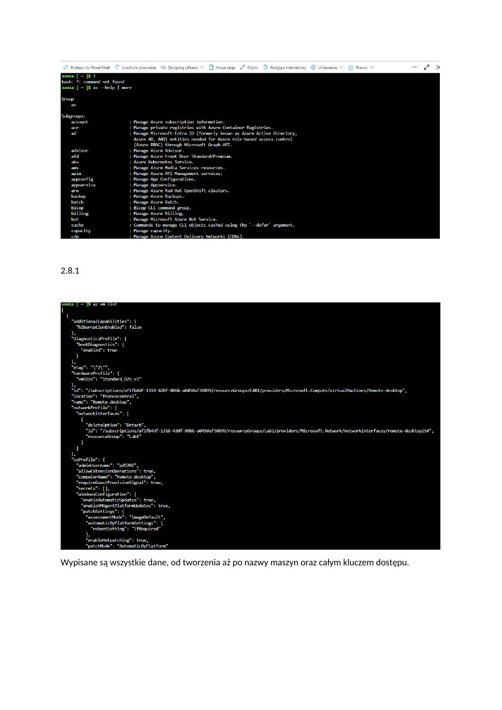

---

### Ping między maszynami

Po umieszczeniu maszyn U1 i U2 w tej samej sieci wirtualnej, komunikacja ICMP (ping) działa poprawnie:

```bash
ping 172.16.0.5   # ping z U1 na U2
```

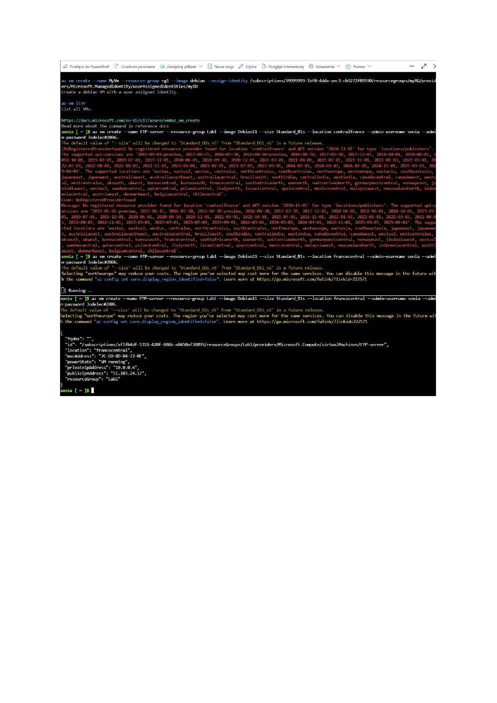

---

### Routing – `ip route`

Komenda `ip route` pozwala sprawdzić tablicę routingu systemu Linux na maszynie wirtualnej:

```bash
ip route
```

Na obu maszynach (U1, U2) widoczna jest domyślna brama o adresie `172.16.0.1`. Brama domyślna jest zarządzana przez Azure i jest przezroczysta dla systemu operacyjnego.

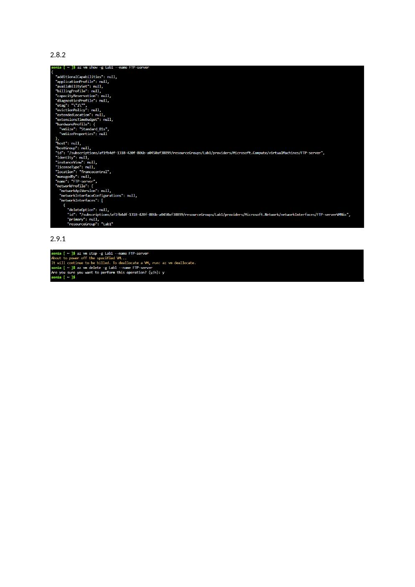

> **Wniosek:** Brama domyślna (`172.16.0.1`) nie odpowiada na ping – jest to oczekiwane zachowanie infrastruktury Azure, która zarządza routingiem wewnętrznie.

---

### 3.4.1 & 3.4.2 – Grupy zabezpieczeń sieci (NSG)

**Network Security Group (NSG)** to wirtualna zapora działająca na poziomie podsieci lub karty sieciowej (NIC). Zawiera reguły **przychodzące (inbound)** i **wychodzące (outbound)**.

**Domyślne reguły NSG:**

| Priorytet | Reguła | Akcja |
|-----------|--------|-------|
| 65000 | AllowVnetInBound | Zezwól |
| 65001 | AllowAzureLoadBalancerInBound | Zezwól |
| 65500 | DenyAllInBound | Odmów |

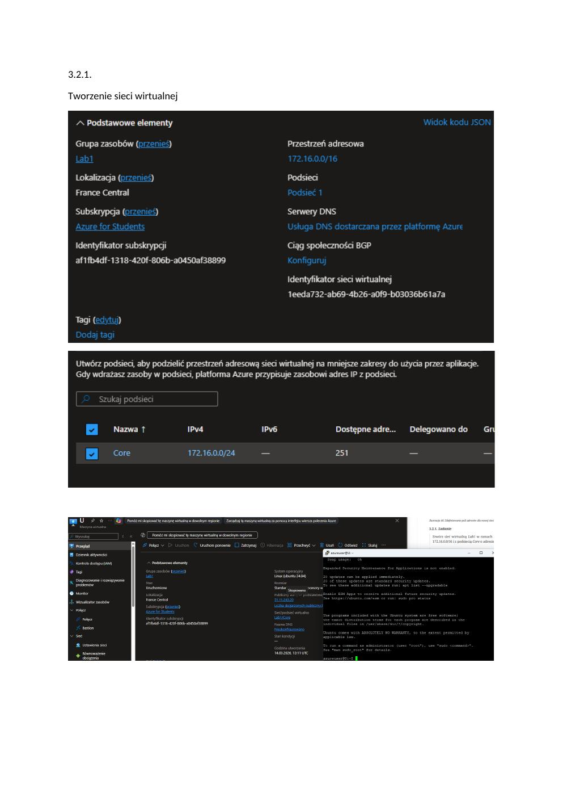

---

### 3.4.3 – NSG na poziomie podsieci vs. karty sieciowej

> **Pytanie:** Czy przypisanie NSG do podsieci pozwala na usunięcie jej z poziomu maszyn?

**Tak.** Przypisanie NSG do podsieci daje następujące korzyści:

- **Centralizacja zarządzania** – jedna reguła chroni wszystkie maszyny w podsieci
- **Automatyczne stosowanie** – każda nowa VM w podsieci `Core` automatycznie dziedziczy reguły (port 22 i 3389)
- **Hierarchia filtrowania** – ruch jest filtrowany najpierw na poziomie podsieci, potem (opcjonalnie) na poziomie NIC maszyny

---

### 3.4.4 – Maszyna `Webservice`

Utworzono maszynę **Ubuntu Server 18.04 LTS** z następującą konfiguracją:

| Parametr | Wartość |
|----------|---------|
| Nazwa | `Webservice` |
| System | Ubuntu Server 18.04 LTS |
| Uwierzytelnianie | Klucz publiczny SSH |
| Podsieć | `Web` (`172.16.1.0/24`) |
| NSG | Odpowiednia dla podsieci Web |

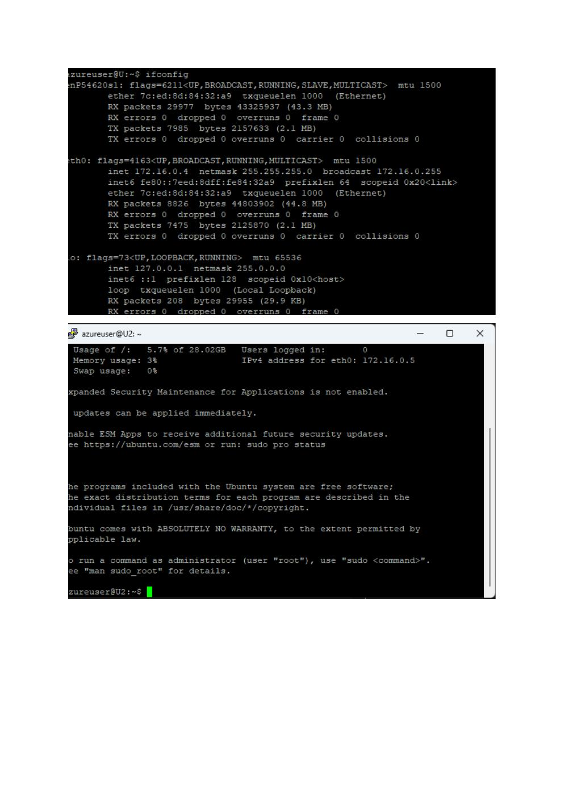

---

### 3.4.7 – Połączenie z U1 na Webservice (przez publiczne IP)

Próba połączenia z maszyny U1 na maszynę Webservice przez **publiczny adres IP** zakończyła się niepowodzeniem.

**Przyczyna:** Maszyny w Azure często nie mogą łączyć się ze sobą przez publiczne IP z wnętrza tej samej sieci wirtualnej. Jest to znane ograniczenie – brak tzw. **NAT Loopback**. Ruch wychodzący na publiczne IP i powracający do tej samej sieci jest blokowany przez domyślne mechanizmy routingu Azure.

```
✅ Połączenie przez prywatne IP:  172.16.x.x → działa
❌ Połączenie przez publiczne IP: [publiczny-IP] → zablokowane (NAT Loopback)
```

---

### 3.4.8 – Reguły Deny i priorytety NSG

Po dodaniu reguły **Deny** z priorytetem `90` dla ruchu HTTP z podsieci `172.16.1.0/24`:

```
Wynik: Przeglądarka Lynx "wisi" na komunikacie "Making HTTP connection"
```

**Wnioski:**
- Reguła **Deny o wyższym priorytecie** (niższym numerze) skutecznie blokuje ruch
- Nawet jeśli istnieje reguła zezwalająca na port 80, reguła blokująca z niższym numerem priorytetu wygrywa
- Hierarchia: im **niższy numer** priorytetu, tym reguła jest **ważniejsza**

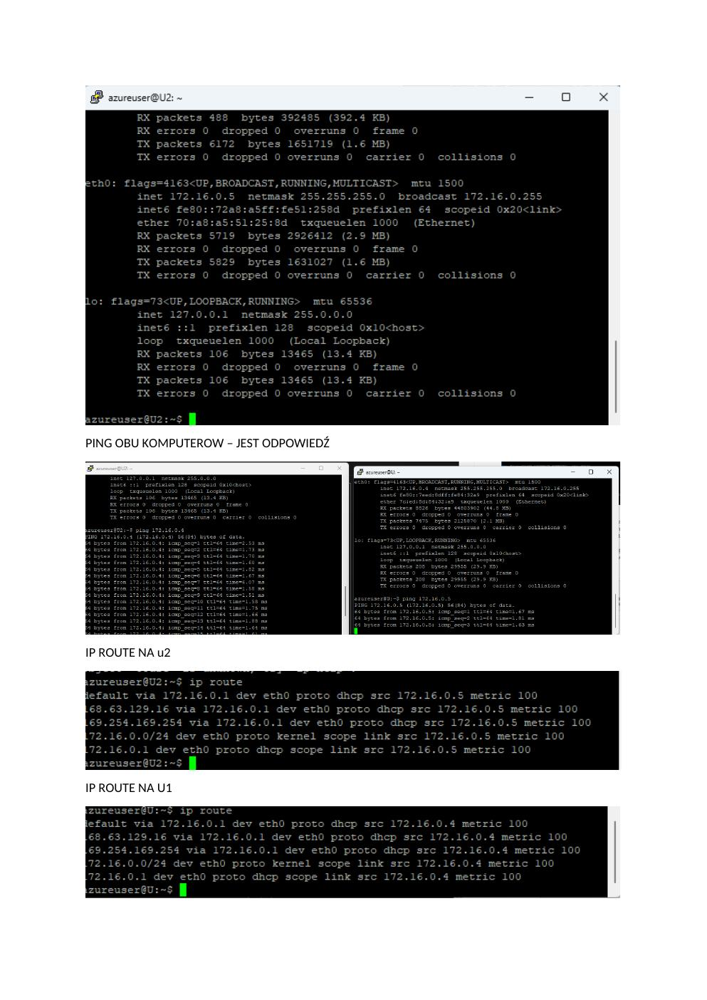

**Podsumowanie testu NSG:**
- Połączenie po **prywatnym IP** było możliwe – obie podsieci należą do `Lab1`
- Po dodaniu reguły Deny (priorytet 90) dla portu 80 – ruch HTTP z `Webservice` do `U1` przestał działać

---

### 3.5.1 – VNet Peering (komunikacja równorzędna)

Maszyna `Magazyn1` należy do odrębnej sieci `Lab1_Magazyn`. Bez dodatkowej konfiguracji sieci są **całkowicie izolowane**.

**Rozwiązanie: VNet Peering**

Po zestawieniu komunikacji równorzędnej:

```bash
ping 172.16.0.4   # ping z Magazyn1 na U1 → ✅ działa
curl http://172.16.1.5   # HTTP → ✅ działa
```

> **Dlaczego `ip route` nie pokazuje nowej trasy?**
>
> Po zestawieniu VNet Peeringu, komenda `ip route` na maszynie `Magazyn1` nie wyświetla jawnie nowej trasy. Jest to typowe zachowanie Azure – trasy systemowe (**System Routes**) są zarządzane przez wirtualny router infrastruktury (**Azure Fabric**) i są przezroczyste dla systemu operacyjnego gościa. Mimo to łączność działa poprawnie.

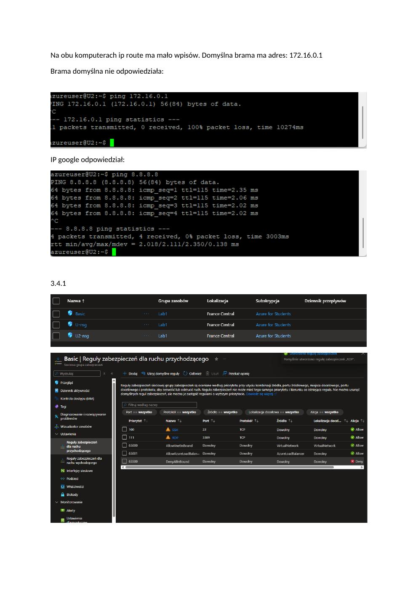

---

## Rozdział 4 – Zapora sieciowa (Azure Firewall)

### 4.2 – Tworzenie zapory

**Azure Firewall** to zarządzana usługa zapory sieciowej działająca na poziomie sieci wirtualnej. W odróżnieniu od NSG, obsługuje pełną inspekcję ruchu warstwy aplikacji (L7).

> **Ważne:** Sam fakt uruchomienia instancji Azure Firewall **nie zmienia automatycznie** przepływu ruchu. Aby ruch był kierowany przez zaporę, konieczne jest skonfigurowanie **tabeli tras (Route Table)**.

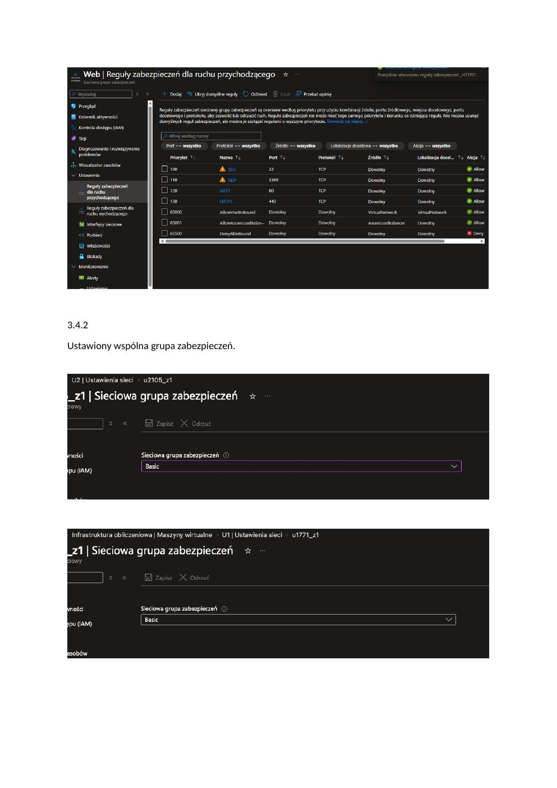

Po uruchomieniu zapory, maszyny nadal były dostępne przez własne publiczne IP, bo ruch nie był jeszcze kierowany przez zaporę.

---

### 4.3.1 – Tabele tras (Route Tables)

**Route Table** to zasób Azure pozwalający definiować niestandardowe trasy dla ruchu sieciowego. Pozwala wymusić kierowanie ruchu przez określone urządzenie (np. zaporę).

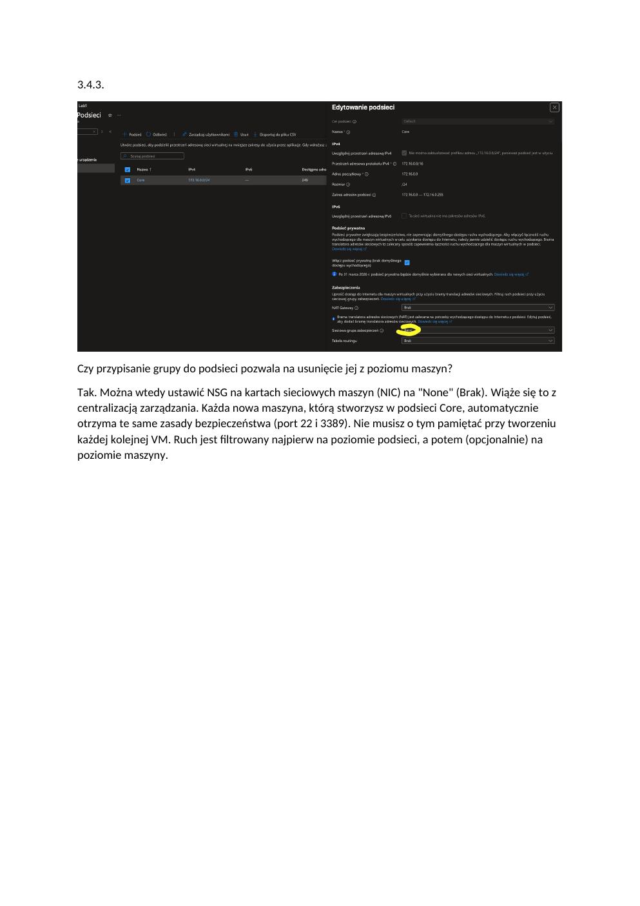

---

### 4.3.2 – Skojarzenie tabeli tras z podsieciami

Tabela tras `Lab1` została skojarzona z podsieciami **Core** i **Web** sieci `Lab1`.

---

### 4.3.3 – Trasa domyślna "Zapora"

Utworzono trasę domyślną:

| Parametr | Wartość |
|----------|---------|
| Nazwa | `Zapora` |
| Prefiks docelowy | `0.0.0.0/0` |
| Typ następnego przeskoku | `Virtual Appliance` |
| Adres następnego przeskoku | Prywatny IP zapory Azure |

> **Co oznacza prefiks `0.0.0.0/0`?**
> Jest to **trasa domyślna** – obejmuje wszystkie możliwe adresy IP, które nie pasują do bardziej szczegółowych tras lokalnych. Oznacza: "cały ruch, który nie ma innej trasy – wyślij przez zaporę."

**Efekt:** Po skojarzeniu tabeli tras – **brak odpowiedzi do żadnej maszyny (U1, U2, Webservice, Magazyn1)** przez SSH z Internetu.

**Przyczyna:** Ruch powrotny z maszyn jest kierowany do zapory, ale zapora nie ma jeszcze skonfigurowanych reguł zezwalających – blokuje wszystko domyślnie.

---

### 4.4.1 – Reguły DNAT (Destination NAT)

**DNAT** pozwala przekierować ruch przychodzący na publiczny IP zapory do konkretnej maszyny wirtualnej w sieci prywatnej.

**Przykład konfiguracji DNAT:**

| Parametr | Wartość |
|----------|---------|
| Źródłowy IP | `*` (dowolny) |
| Protokół | TCP |
| Port docelowy (zapora) | `4022` |
| Przetłumaczony adres | `172.16.0.4` (U1) |
| Przetłumaczony port | `22` |

**Test połączenia:**
```bash
ssh -p 4022 azureuser@20.111.60.231
# → Permission denied (publickey)
```

Komunikat `Permission denied (publickey)` **potwierdza, że reguła DNAT działa poprawnie** – pakiety dotarły do maszyny U1 przez zaporę. Błąd wynika z braku klucza SSH, nie z blokady sieciowej.

```bash
# Wymuszenie uwierzytelniania hasłem:
ssh -p 4022 -o PreferredAuthentications=password azureuser@20.111.60.231
# → ✅ Połączenie udane
```

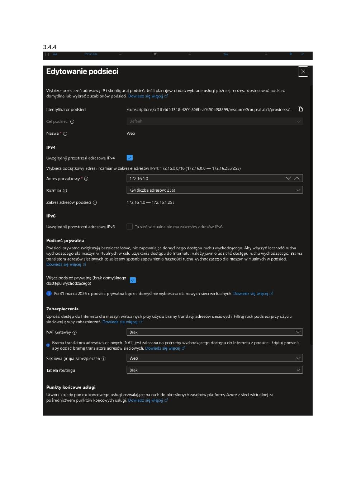

> **Dlaczego strona WWW nie otwierała się po skonfigurowaniu DNAT?**
>
> Reguły DNAT obsługują tylko ruch **przychodzący**. Maszyna U1 nie miała reguł zezwalających na ruch **wychodzący** (Network Rules / Application Rules), więc zapora blokowała dostęp do Internetu.

---

### 4.4.2 – Reguły Application Rules (HTTP/HTTPS)

Po dodaniu reguły Application Rule zezwalającej na ruch wychodzący TCP:

```bash
# Test z maszyny U1:
curl https://microsoft.com   # ✅ Działa
curl https://wpl.pl           # ✅ Działa
ping 8.8.8.8                  # ❌ Nie działa (Request timeout)
```

> **Dlaczego ping nie działał?**
>
> Reguły Application Rules zezwalały tylko na protokół **TCP** (dla stron WWW). Polecenie `ping` używa protokołu **ICMP**, który nie był objęty regułą. Aby umożliwić ping, konieczne jest dodanie reguły **Network Rule** dla protokołu ICMP.

**Rozwiązanie:** Dodano regułę Network Rule dla ICMP z sieci Core → `8.8.8.8` → ping zaczął działać.

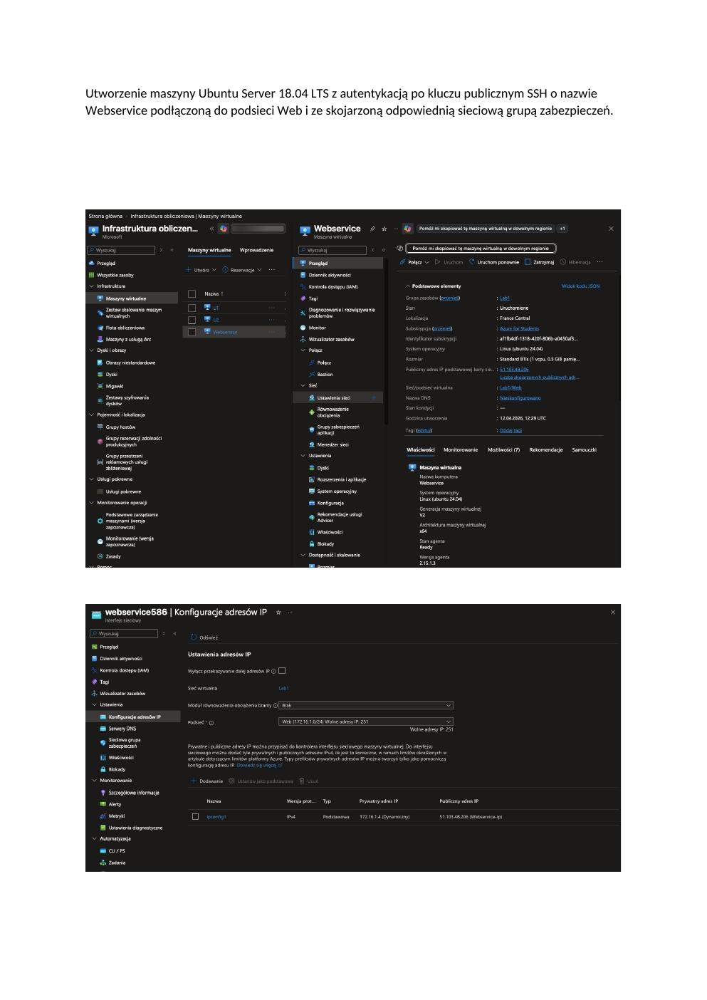

---

### 4.4.3 – Usunięcie zasobów

Po zakończeniu ćwiczeń wszystkie zasoby zostały usunięte z Azure, aby uniknąć niepotrzebnych kosztów.

> 💡 **Dobra praktyka:** Zawsze usuwaj nieużywane zasoby Azure lub korzystaj z harmonogramów automatycznego zatrzymywania maszyn wirtualnych, aby zoptymalizować koszty.

---

## Wnioski końcowe

| Temat | Kluczowe wnioski |
|-------|-----------------|
| **Maszyny wirtualne** | Azure umożliwia szybkie tworzenie VM z Linux i Windows; klucze SSH są bezpieczniejsze od haseł |
| **VNet i podsieci** | Sieci wirtualne izolują ruch; podsieci pozwalają segmentować środowisko |
| **NSG** | Priorytety reguł są kluczowe – niższy numer = wyższy priorytet; NSG na podsieci centralizuje zarządzanie |
| **NAT Loopback** | Maszyny Azure nie mogą łączyć się ze sobą przez publiczne IP z tej samej sieci |
| **VNet Peering** | Łączy odrębne sieci wirtualne; trasy systemowe są przezroczyste dla systemu operacyjnego |
| **Azure Firewall** | Wymaga konfiguracji tabel tras + reguł DNAT/Network/Application; domyślnie blokuje wszystko |
| **DNAT** | Przekierowuje ruch z publicznego IP zapory do prywatnych VM; działa tylko dla ruchu przychodzącego |

---

## Struktura repozytorium

```
azure-lab-project/
│
├── README.md                    ← Ten plik – pełna dokumentacja projektu
│
└── screenshots/                 ← Screenshoty ze sprawozdania
    ├── page-01.jpg              ← Portal Azure – strona startowa
    ├── page-02.jpg              ← Propozycje usług Microsoft
    ├── page-03.jpg              ← Tworzenie VM – formularz
    ├── page-04.jpg              ← VM Ubuntu w portalu
    ├── page-05.jpg              ← VM Windows w portalu
    ├── page-06.jpg              ← ls -la na maszynie Linux
    ├── page-07.jpg              ← Dane maszyn i klucze dostępu
    ├── page-08.jpg              ← Widok grupy zasobów
    ├── page-09.jpg              ← Tworzenie VNet
    ├── page-10.jpg              ← Ping między maszynami
    ├── page-11.jpg              ← ip route na U1 i U2
    ├── page-12.jpg              ← Konfiguracja NSG
    ├── page-13.jpg              ← Maszyna Webservice
    ├── page-14.jpg              ← Reguła Deny w NSG
    ├── page-15.jpg              ← VNet Peering
    ├── page-16.jpg              ← Tworzenie Azure Firewall
    ├── page-17.jpg              ← Tabela tras
    ├── page-18.jpg              ← Reguły DNAT
    ├── page-19.jpg              ← Reguły Application Rules
    └── ...                      ← Pozostałe screenshoty
```

---

## 🔧 Użyte technologie i usługi Azure


- **Azure Virtual Machines** – VM Linux (Ubuntu) i Windows Server
- **Azure Virtual Network (VNet)** – sieci `Lab1` i `Lab1_Magazyn`
- **Network Security Groups (NSG)** – reguły inbound/outbound
- **VNet Peering** – komunikacja równorzędna między sieciami
- **Azure Firewall** – zapora sieciowa z regułami DNAT, Network i Application
- **Route Tables** – niestandardowe tablice tras dla podsieci
- **SSH** – bezpieczne połączenia z maszynami Linux

---

*Sprawozdanie: Pd5206 | Przedmiot: Usługi i infrastruktura chmurowa | Platforma: Microsoft Azure*
