# 🐳 Kubernetes na Azure – mój pierwszy klaster

> Projekt zapoznawczy z Azure Kubernetes Service (AKS) zrealizowany w ramach kursu chmurowego.  
> Wdrożyłam kontenerową aplikację **Lychee** na zarządzanym klastrze Kubernetes w chmurze Microsoft Azure.

---

## 📌 O projekcie

Samodzielnie postawiłam klaster AKS od zera, napisałam manifest YAML, zdebugowałam błąd środowiskowy aplikacji i wdrożyłam działający serwis dostępny publicznie przez LoadBalancer. Cały proces przeszłam ręcznie – od konfiguracji w Azure Portal, przez Cloud Shell, aż po `kubectl`.

---

## 🛠️ Stack techniczny

| Technologia | Rola |
|---|---|
| **Azure Kubernetes Service (AKS)** | Zarządzany klaster Kubernetes |
| **kubectl** | Zarządzanie zasobami klastra z CLI |
| **Azure Cloud Shell** | Środowisko pracy (bash) |
| **Docker / lscr.io** | Rejestr obrazów kontenerów |
| **Lychee** | Wdrożona aplikacja (galeria zdjęć) |
| **Azure Portal** | Konfiguracja infrastruktury |

---

## 🚀 Co zrobiłam krok po kroku

### 1. Konfiguracja klastra AKS w Azure Portal

Wypełniłam formularz tworzenia klastra `klaster-lychee`:

- **Subskrypcja:** Azure for Students  
- **Grupa zasobów:** Lab1  
- **Region:** France Central  
- **Wersja Kubernetes:** 1.34.7  
- **Uaktualnienia automatyczne:** patch (co tydzień w niedzielę)  
- **Konfiguracja wstępna:** Tworzenie i testowanie  

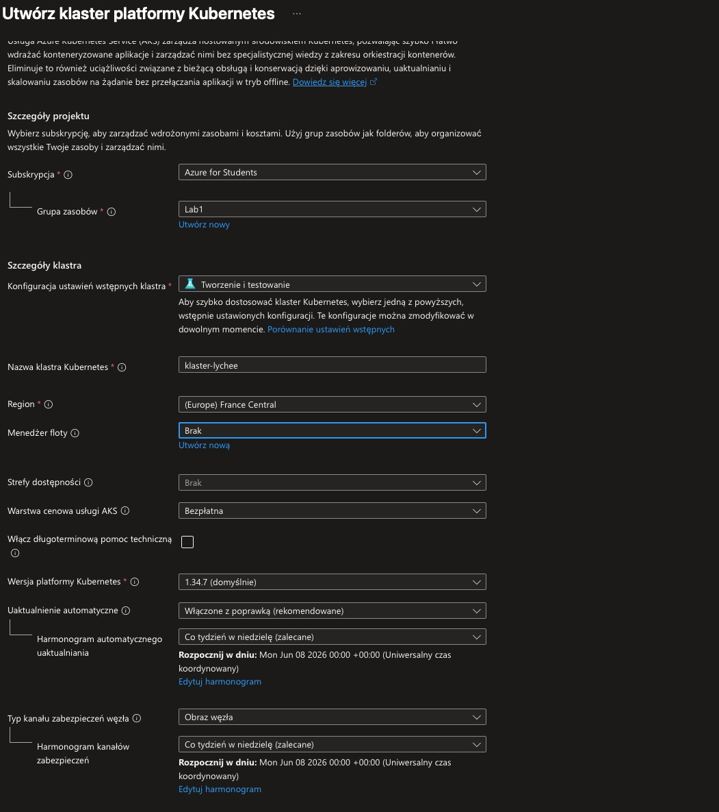

---

### 2. Konfiguracja puli węzłów

Skonfigurowałam pulę węzłów `agentpool`:

- **Tryb:** System  
- **System operacyjny:** Ubuntu Linux  
- **Rozmiar węzła:** Standard_A2_v2 (2 vCPU, 4 GiB RAM)  
- **Metoda skalowania:** Ręczna  
- **Liczba węzłów:** 1  

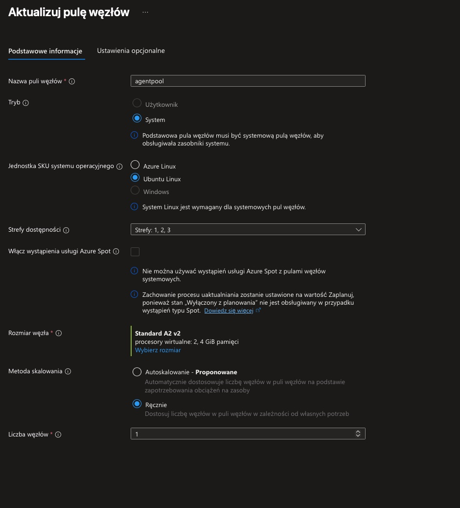

Poniżej podsumowanie wszystkich ustawień przed wdrożeniem:

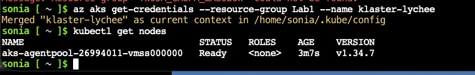

---

### 3. Wdrożenie klastra

Po zatwierdzeniu konfiguracji klaster zaczął się tworzyć. W Azure Portal widoczny był status wdrożenia zasobu `Microsoft.ContainerService/managedClusters`:

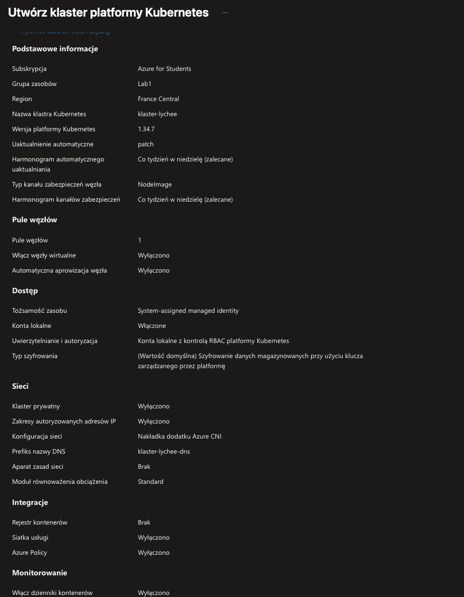

Po zakończeniu wdrożenia w panelu klastra pojawiły się wszystkie właściwości – m.in. wersja Kubernetes 1.34.7, konfiguracja sieci Azure CNI oraz ustawienia zabezpieczeń:

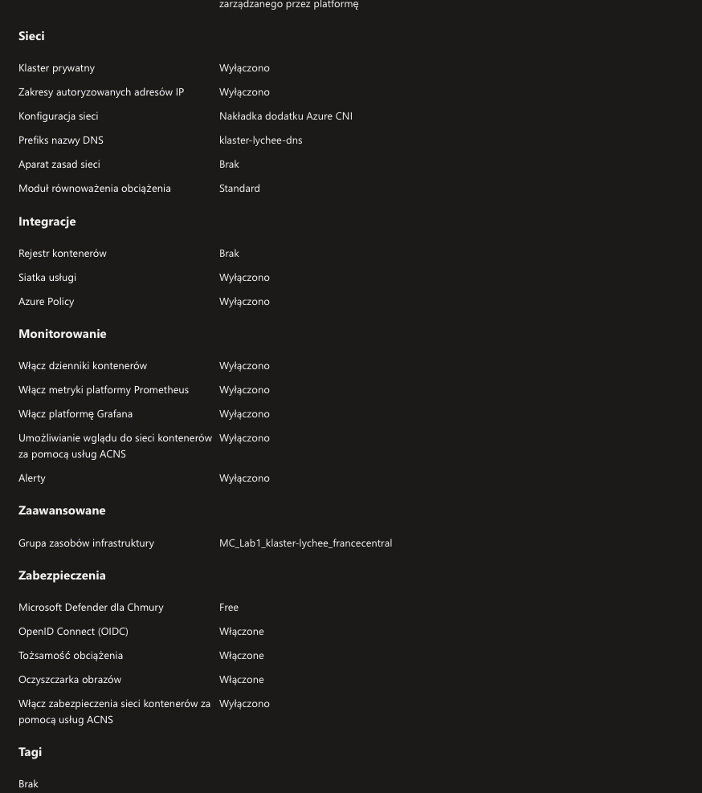

Dodatkowe ustawienia sieci i integracji (wszystkie opcjonalne wyłączone, Microsoft Defender Free):

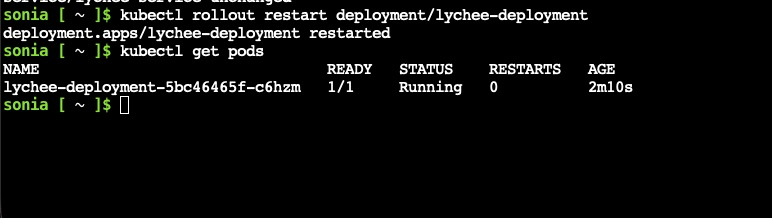

---

### 4. Połączenie z klastrem przez CLI

Po wdrożeniu pobrałam poświadczenia do lokalnego `kubeconfig` i zweryfikowałam węzeł:

```bash
az aks get-credentials --resource-group Lab1 --name klaster-lychee
kubectl get nodes
```

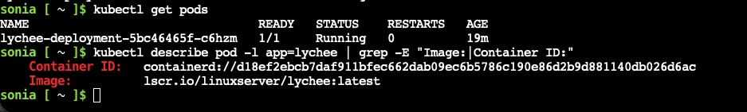

---

### 5. Przygotowanie manifestu YAML

Napisałam plik `lychee.yaml` w edytorze nano w Cloud Shell – definicja `Deployment`:

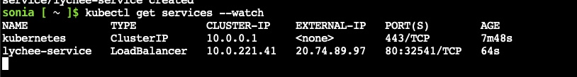

Oraz definicja `Service` typu LoadBalancer w tym samym pliku:

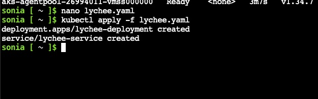

Pełna zawartość pliku `lychee.yaml`:

```yaml
apiVersion: apps/v1
kind: Deployment
metadata:
  name: lychee-deployment
  labels:
    app: lychee
spec:
  replicas: 1
  selector:
    matchLabels:
      app: lychee
  template:
    metadata:
      labels:
        app: lychee
    spec:
      containers:
      - name: lychee
        image: lscr.io/linuxserver/lychee:latest
        ports:
        - containerPort: 80
        env:
        - name: PUID
          value: "1000"
        - name: PGID
          value: "1000"
        - name: TZ
          value: "Europe/Warsaw"
---
apiVersion: v1
kind: Service
metadata:
  name: lychee-service
spec:
  type: LoadBalancer
  ports:
  - port: 80
    targetPort: 80
  selector:
    app: lychee
```

---

### 6. Pierwsze wdrożenie i błąd CrashLoopBackOff

Po uruchomieniu `kubectl apply -f lychee.yaml` zasoby zostały utworzone:

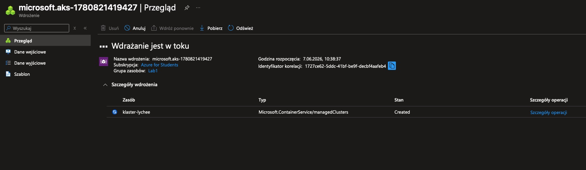

Jednak pod wpadł w pętlę `CrashLoopBackOff`. Przeanalizowałam logi, które ujawniły przyczynę:

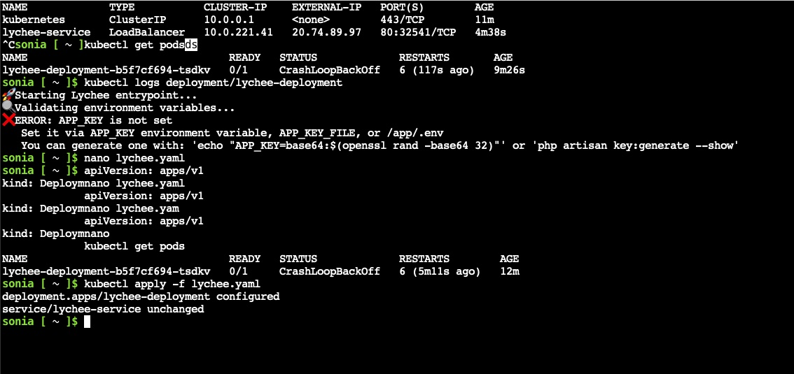

Aplikacja Lychee wymaga zmiennej środowiskowej `APP_KEY`. Zaktualizowałam manifest w nano, dodałam brakującą zmienną i ponownie zastosowałam konfigurację:

```bash
kubectl apply -f lychee.yaml
# deployment.apps/lychee-deployment configured
# service/lychee-service unchanged
```

---

### 7. Restart wdrożenia i weryfikacja

Po poprawce wykonałam `rollout restart` i zweryfikowałam, że pod działa:

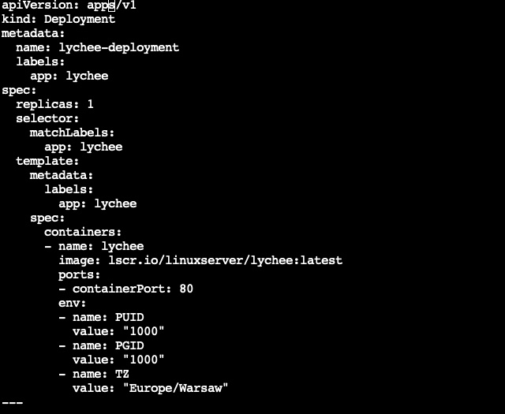

---

### 8. Sprawdzenie zewnętrznego IP serwisu

Poczekałam na przydzielenie publicznego IP przez Azure LoadBalancer:

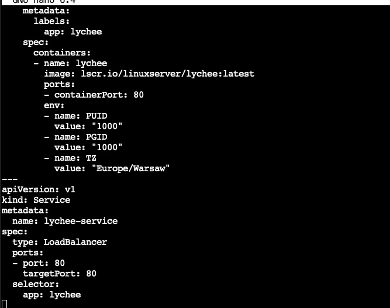

Aplikacja działała pod publicznym adresem `20.74.89.97:80`.

---

### 9. Inspekcja działającego kontenera

Sprawdziłam szczegóły poda – Container ID i obraz:

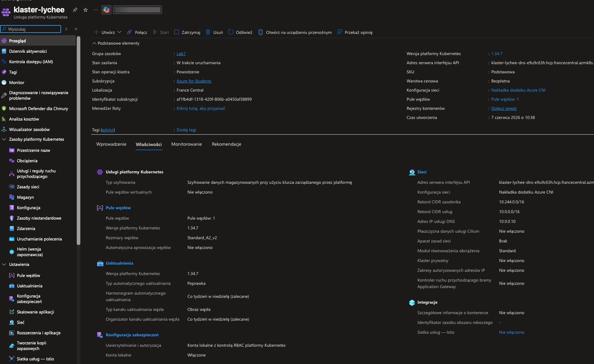

---

## 📊 Architektura projektu

```
Internet
    │
    ▼
Azure LoadBalancer (20.74.89.97:80)
    │
    ▼
lychee-service (ClusterIP: 10.0.221.41)
    │
    ▼
lychee-deployment (1 replika)
    │
    └── Container: lscr.io/linuxserver/lychee:latest
```

---

## 💡 Czego się nauczyłam

- Tworzenia i konfigurowania klastra AKS w Azure Portal
- Pisania manifestów YAML (`Deployment` + `Service`)
- Debugowania błędów kontenerów przez `kubectl logs`
- Pracy z `kubectl` (apply, get, describe, rollout restart)
- Różnicy między typami serwisów Kubernetes (ClusterIP vs LoadBalancer)
- Jak Azure automatycznie zarządza trasami sieciowymi w AKS

---

## 🔧 Jak odtworzyć projekt

```bash
# 1. Sklonuj repozytorium
git clone <repo-url>
cd kubernetes-lychee

# 2. Zaloguj się do Azure i utwórz klaster
az login
az group create --name Lab1 --location francecentral
az aks create \
  --resource-group Lab1 \
  --name klaster-lychee \
  --node-count 1 \
  --node-vm-size Standard_A2_v2 \
  --generate-ssh-keys

# 3. Pobierz poświadczenia
az aks get-credentials --resource-group Lab1 --name klaster-lychee

# 4. Wdróż aplikację
kubectl apply -f lychee.yaml

# 5. Sprawdź publiczny IP
kubectl get services --watch
```

---

## 📁 Struktura repozytorium

```
.
├── README.md
├── lychee.yaml           # manifest Kubernetes (Deployment + Service)
└── screenshots/
    ├── 1.png             # formularz tworzenia klastra
    ├── 2.png             # konfiguracja puli węzłów
    ├── 3.png             # wdrażanie klastra w toku
    ├── 4.png             # panel klastra – właściwości
    ├── 5.png             # kubectl apply – created
    ├── 6.png             # kubectl describe – Container ID
    ├── 7.png             # podsumowanie konfiguracji
    ├── 8.png             # manifest YAML – Service
    ├── 9.png             # manifest YAML – Deployment
    ├── 10.png            # CrashLoopBackOff + błąd APP_KEY
    ├── 11.png            # rollout restart – Running
    ├── 12.png            # kubectl get services – zewnętrzny IP
    ├── 13.png            # właściwości klastra – Sieci/Integracje
    └── 14.png            # kubectl get nodes – węzeł Ready
```

---

*Projekt zrealizowany jako część kursu z technologii chmurowych – Azure & Kubernetes.*
